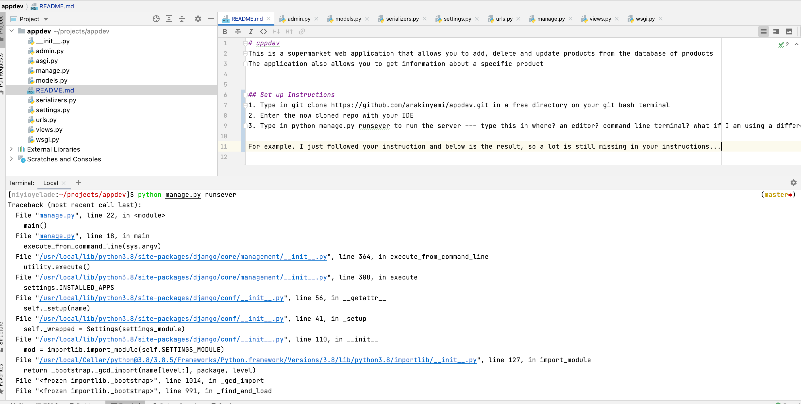

# appdev
This is a supermarket web application that allows you to add, delete and update products from the database of products
The application also allows you to get information about a specific product

## Set up Instructions
1. Type in git clone https://github.com/arakinyemi/appdev.git in a free directory on your git bash terminal
2. Enter the now cloned repo with your IDE
3. Type in python manage.py runsever to run the server --- type this in where? an editor? command line terminal? what if I am using a different IDE? Will this work in Pycharm? So much is missing here...should you be asking the person to set up a virtual environment?

For example, I just followed your instruction and below is the result, so a lot is still missing in your instructions...

